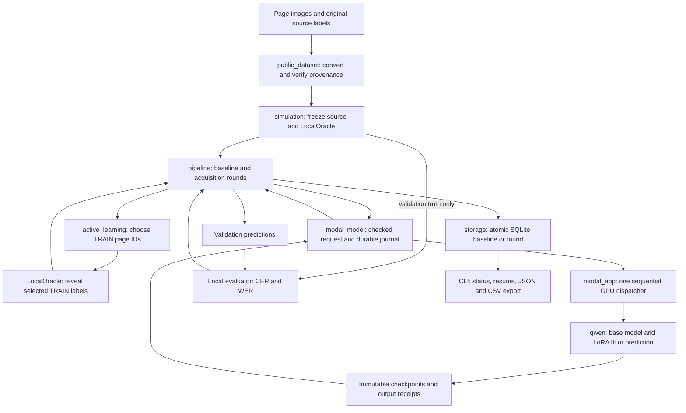

# OCR active-learning project — Stage 2 engineering report and guide

**Status: 18 September 2026. Stage 2 engineering is complete.** One real active-learning
round ran through selection, simulated annotation, GPU fine-tuning, checkpoint reload,
validation, persistence, resume and export. Independent artifact review passed.
**Usable OCR and an active-learning advantage have not been demonstrated.**

This is the maintained project document for understanding the repository and operating its
pipeline. It replaces the separate simulation, Qwen, Modal preflight/runtime/deployment guides
and the completed staged implementation plan. Dated research notes and verification/run records
remain supporting evidence, rather than competing descriptions of current status.

The measured execution used source `1a03f77519439c0601a83c8c3b4670ca896de337`.
Acceptance is recorded in [EXP-003](../experiments/EXP-003.md) and the
[independent runtime review](verification/modal-runtime-review.md). The current code subsequently removes the legacy services and fixes decode capacity under recipe
v2. That local correction has not been validated by a new GPU run; the v1 results below remain
unchanged. Old runs retain their exact source identity and frozen execution checkout.

## Contents

1. [Purpose and current stage](#1-purpose-and-current-stage)
2. [Complete repository map](#2-complete-repository-map)
3. [How the components connect](#3-how-the-components-connect)
4. [Data preparation and label isolation](#4-data-preparation-and-label-isolation)
5. [Active-learning lifecycle](#5-active-learning-lifecycle)
6. [Qwen model and fine-tuning](#6-qwen-model-and-fine-tuning)
7. [Modal execution, persistence and recovery](#7-modal-execution-persistence-and-recovery)
8. [Setup and operating procedure](#8-setup-and-operating-procedure)
9. [The completed real round](#9-the-completed-real-round)
10. [Engineering verification and resolved problems](#10-engineering-verification-and-resolved-problems)
11. [Research progress and next steps](#11-research-progress-and-next-steps)
12. [Team responsibilities and documentation policy](#12-team-responsibilities-and-documentation-policy)

## 1. Purpose and current stage

The research question is whether active learning can reduce the annotation required to adapt
OCR to historical and low-resource documents. A **page image is the acquisition unit**; its
labels are ordered line boxes and transcriptions. Existing dataset labels simulate a human
annotator: only labels for selected training pages are revealed to training. There is no need
to manually label this corpus or build a labeling frontend for the present study.

| Stage | Delivered or remaining |
| --- | --- |
| Stage 1: local foundation | Image import, shared models, selectors, metrics, SQLite/artifacts, CLI, deterministic simulation, source-label oracle and isolated evaluator. |
| Stage 2: connected real execution — complete | Pinned READ2016 conversion, verified assets, real Qwen LoRA runtime, Modal dispatch/recovery, initial baseline, one actual acquired training round, fresh-process checkpoint reload, exports and independent verification. |
| Stage 3: useful OCR and research experiments — next | Calibrate output format and decode capacity; establish an adequate initial adaptation recipe; define grouping/evaluation and real uncertainty; compare equal budgets across seeds, then datasets/models. |

The implemented real path currently supports **random acquisition only**. Least-confidence
and entropy selectors exist and work with fixture/test scores, but Qwen does not yet produce
reviewed acquisition scores. The two-page real run is an engineering smoke test, not an
uncertainty-strategy comparison or a sufficient initial fine-tuning campaign.

## 2. Complete repository map

The following lists the source, configuration, tests and maintained documentation. Generated
environments, raw data and Git internals are deliberately outside the tracked tree.

```text
ocr-finetuning/
├── README.md                         short entry point to this guide
├── AGENTS.md                         research/engineering rules and role ownership
├── pyproject.toml                    package, CLI scripts, extras and lint/test settings
├── uv.lock                           resolved dependency lock
├── .python-version                   local Python selection
├── .gitignore                        excludes secrets, data, runs and private coordination
├── examples/
│   └── simulate.py                   no-service fixture: generate → run → resume → export
├── src/active_ocr/
│   ├── __init__.py
│   ├── models.py                     immutable source/run/prediction contracts
│   ├── active_learning.py            deterministic random/confidence/entropy ranking
│   ├── evaluation.py                 text counts, CER/WER, IoU and curve helpers
│   ├── pipeline.py                   one orchestrator, including simulation/real lifecycle
│   ├── integrations/
│   │   ├── __init__.py               explicit imports; local tools avoid loading ML packages
│   │   ├── storage.py                SQLite records, atomic updates, hashed artifacts
│   │   ├── simulation.py             normalized source, oracle, fixture, evaluator, identity
│   │   ├── public_dataset.py         pinned READ2016 conversion and provenance verification
│   │   ├── qwen.py                   actual load/predict/reset-fit/checkpoint/reload boundary
│   │   └── modal_model.py            remote contract, coordinator, operation journal/recovery
│   └── entrypoints/
│       ├── __init__.py
│       ├── cli.py                    simulation and real create/run/status/resume/export
│       └── modal_app.py              CPU build gate, single dispatcher, isolated model children
├── tests/
│   ├── test_core.py                  shared models/selection fundamentals
│   ├── test_simulation.py            fixture lifecycle, budgets, freeze and persistence
│   ├── test_real_contract.py         baseline/real-shaped adapter contracts
│   ├── test_contract_independent.py  independent local contract checks
│   ├── test_evaluation_counts.py     text normalization, errors and undefined rates
│   ├── test_public_dataset.py        READ conversion and provenance
│   ├── test_read2016_independent.py  independent READ source checks
│   ├── test_qwen.py                  model helpers and actual processor/tiny-model CPU cases
│   ├── test_qwen_independent.py      independent Qwen/checkpoint checks
│   ├── test_modal_model.py           transport, identities, journal and artifact validation
│   ├── test_modal_app.py             build and worker contracts
│   ├── test_modal_independent.py     independent worker/transport/recovery checks
│   └── test_real_cli.py              real CLI wiring and export
├── docs/
│   ├── PROJECT_GUIDE.md              this maintained project document
│   └── verification/                dated evidence; PASS applies to the stated SHA/scope
│       ├── local-contract-review.md
│       ├── read2016-converter-review.md
│       ├── qwen-runtime-review.md
│       ├── modal-runtime-review.md
│       ├── modal-cpu-runtime.md      actual CPU attempt history, including failures
│       └── modal-cpu-review.md
├── experiments/
│   ├── README.md / TEMPLATE.md       small reproducibility record convention
│   ├── EXP-001.md / EXP-002.md       preserved earlier unsuccessful execution attempts
│   ├── EXP-003.md                    accepted completed real round
│   └── assets/read2016-qwen3vl4b.json published source/file identities and staging evidence
├── research/
│   ├── README.md / TEMPLATE.md
│   └── RES-002-real-ocr-pilot.md      dated source-backed dataset/model recommendation
├── plans/
│   └── README.md / TEMPLATE.md       future approved plans; completed plan is in Git history
├── coordination/
│   └── README.md / TASK_TEMPLATE.md  reusable team protocol, not application runtime state
├── .agents/skills/
│   ├── manager/SKILL.md
│   ├── research/SKILL.md
│   ├── planning/SKILL.md
│   ├── development/SKILL.md
│   ├── testing/SKILL.md
│   ├── experiment-platform/SKILL.md
│   └── qa-understanding/SKILL.md
└── scripts/
    ├── validate_agent_system.py      portable/local coordination integrity checks
    └── test_agent_system.py          protocol checker tests
```

Ignored local layout: `.venv/` holds local dependencies; `.local/assets/` downloads;
`.local/prepared/` normalized data; `.local/execution/` frozen execution checkouts;
`.local/verification/` configuration, receipts, runs and exports; `.local/qa-understanding/`
presentation drafts/visuals; `.agent-local/` shared private task/decision/ops records;
`var/` retained historical state; `.env` secrets, if any. These are not included in a fresh clone.
Cloud input/output Volumes are external artifacts, not repository folders.

## 3. How the components connect



| Component | Receives | Produces / connection |
| --- | --- | --- |
| `public_dataset.convert_read2016` | Pinned archive and safely extracted originals | Preserved `source/`, `provenance.json`, normalized `pages.jsonl`. It neither downloads nor trains. |
| `LocalOracle.freeze` / `LocalOracle` | Source manifest, images and provenance | Frozen `DatasetSnapshot`; selected-only `RevealedExample`s; isolated validation truth. |
| `Pipeline` | Frozen config, oracle, model adapter and store | Baseline/round transitions, validation, budgets and exports. No model-specific training logic. |
| `select_pages` | Available TRAIN IDs, seed and permitted pool scores | Unique selected IDs; deterministic ordering/tie handling. No labels or validation metrics. |
| `ModalModel` | Run context and explicit load/fit/predict request | Verified remote checkpoint/predictions; operation journal and known-call reconciliation. |
| `modal_app.dispatch` | Label-free metadata except selected fit examples | Fresh Qwen child execution, hashed evidence and completion receipt. |
| `QwenModel` | Pinned files, verified images, selected training targets when fitting | Actual base/adapter checkpoint, structured predictions, training and reload diagnostics. |
| `PageTextEvaluatorV1` | Validation predictions and validation truth locally | Aggregate text edit counts, CER/WER and explicit failed-page counts. |
| `SQLiteStore` | Validated complete state and artifact bytes | Durable JSON records and content-addressed files; compare-and-swap commit. |

One orchestrator and direct adapters keep the design shallow. There is no separate queue,
workflow service or application database for agent coordination. Fixture, contract-test and
real runs share orchestration but have explicit different run kinds; test outputs cannot silently
become real OCR evidence.

## 4. Data preparation and label isolation

### Actual dataset and source mapping

The staged corpus is **READ2016 / Bozen 1.2.0**, publisher
[Zenodo record 1297399](https://zenodo.org/records/1297399), CC BY 4.0. The retained asset
record contains exact download URLs, sizes, hashes and license observations.

| Source property | Verified value |
| --- | --- |
| Archive | `Train-And-Val-ICFHR-2016.tgz`, 493,223,531 bytes |
| Archive SHA-256 | `f4748c58af757e06804e638a6e84c2150daab19f50d55e10aac3115e6bfc1756` |
| Official membership | 350 TRAIN pages / 50 VALIDATION pages; no final-test archive downloaded |
| Source lines | 8,367 TRAIN + 1,043 VALIDATION = 9,410 |
| Preserved regular files | 804 originals; 400 known image symlinks verified and omitted |
| Source edge cases | Four empty strings and two missing baselines retained |
| Document grouping | Unknown; source `docId=-1` is not a usable document identity |

The converter uses the explicit policy `read2016-official-unknown-engineering-v1`.
Official membership is unchanged and document IDs remain null. This is an approved engineering
exception, not evidence of document-disjoint evaluation. The ordinary `known-document-v1`
policy requires known document IDs and rejects cross-split documents/images. Exact duplicate
image checks do not establish the absence of near duplicates or pretraining overlap.

PAGE XML supplies line order and literal Unicode text. Every original XML/image file is kept
byte-for-byte. The model-facing box is the pixel envelope of each source line polygon;
original polygons and partial unclear/style metadata stay in XML. No trimming, abbreviation
expansion, invented illegibility strings, label repair, crop or split changes occur. Input images
are verified for dimensions, full decoding, RGB and identity orientation for this pinned source.
Generic page-image manifests support common image files; this specific converter expects the
publisher's JPG/XML pairing.

Normalized rows contain `id`, required nullable `document_id`, `image_uri`, `width`, `height`,
`split`, `image_sha256`, ordered `regions`, source policy and provenance reference where required.
Each region has `id`, original-pixel `box`, literal `text` and `illegible`. Missing labels are
different from `regions: []`, which represents a labeled blank page. Invalid geometry, hashes,
duplicate identities, malformed order and unsupported source structures are rejected.

### What leaves the oracle

| Destination | Allowed data |
| --- | --- |
| Acquisition selector | TRAIN membership and eligible model scores; never source text or evaluation results. |
| Fit | Images and true line targets for the run's cumulative selected TRAIN pages only. |
| Prediction | Image ID, split, dimensions, checksum and image address; no XML, regions or truth. |
| Validation evaluator | Only the fixed validation subset's truth and its corresponding predictions. |
| Modal input Volume | Pinned model/processor files and content-addressed images; no oracle, XML, source manifest, DB or label dataset. |
| Final test | Not used by this completed run; final evaluation is deferred. |

Selected fit targets travel transiently through the remote request and first child's stdin.
They are not printed, cached as a trainer dataset or stored in the operation journal. The
second reload child receives image/checkpoint metadata, not labels. These interfaces prevent
accidental leakage; they are not a security sandbox against malicious authorized local code.

Freeze records manifest/ground-truth/image/provenance hashes, membership, seed, configuration,
model/processor revisions, code and dependency identities. Resume rechecks frozen inputs and
refuses changed sources. Original/prepared files must remain available; this is not an automatic
dataset migration or standalone cloud backup.

## 5. Active-learning lifecycle

1. **Create.** Validate and freeze inputs/configuration in a new UUID run. Creation itself does
   not load a model or submit GPU work.
2. **Zero-label baseline.** For a real/contract run, load the pinned base, predict the fixed
   validation images, evaluate locally and commit a separate round-0 baseline. No training
   labels are revealed. The fixture path has no baseline unless a separate contract is used.
3. **Select.** Choose an available TRAIN batch within remaining page budget. The first batch
   is seeded random. Subsequent supported fixture strategies use the prior round's pool scores.
4. **Simulate annotation.** The oracle reveals the selected pages' existing line boxes/text.
   Previously selected IDs remain part of the cumulative labeled set.
5. **Reset-fit.** Begin from the pinned base and train a fresh adapter on all labels revealed
   so far. This is cumulative training data, not warm-starting the previous round's adapter.
6. **Predict and evaluate.** Fixture uncertainty strategies score the remaining TRAIN pool.
   Random skips pool scoring unless explicitly requested in the fixture. The current real
   recipe requires random with no pool reporting; it always evaluates its fixed validation subset.
7. **Commit.** After source/identity/result validation, atomically store the entire new round.
   A stale concurrent writer must reload. A failed step leaves the previous committed round.
8. **Continue or stop.** Stop at page budget, round limit or exhausted pool. Completed resume
   validates inputs and returns without training again. Export reads one committed snapshot.

Selection uses sorted unique candidates, a local seeded random generator, and deterministic
page-ID ties for uncertainty ranking. The round seed is `seed + number_of_committed_rounds`;
the baseline does not shift acquisition. An initial batch counts toward the label budget.
For example, batch 3 with a five-page budget produces batches of 3 and 2.

Predictions must match the exact requested page set and run/round/checkpoint/purpose.
Purposes distinguish `pool`, `baseline_validation` and `validation`. Validation output cannot
be reused as acquisition scores. Failed outputs remain explicit `invalid_output`, `truncated`
or `refusal` records; partial malformed text is not quietly scored as successful OCR.

The evaluator `page-text-nfc-v1` joins declared line text with LF, normalizes CRLF and Unicode
NFC on a copy, and preserves case, punctuation and spacing. It sums per-page Levenshtein edits
before dividing by reference characters or whitespace-separated words. Undefined denominators
have separate defined flags; rates can exceed 1. Failed predictions count as empty hypotheses
with separate failure counts. This is an engineering text view, not official layout-aware
benchmark scoring. IoU and curve helpers exist separately but were not the real run's metrics.

## 6. Qwen model and fine-tuning

**Current correction (18 September, local verification):** the supported target and generated output now share a
4,096-token limit including EOS. The old v1 runtime could train on up to 4,096 target tokens
but generate only 2,048, making sufficiently long targets impossible to reproduce. A single
shared limit now controls training admission, generation, truncation detection, checkpoint
bindings and reload/probe validation. The new IDs are `qwen3-vl-read-engineering-v2` and
`qwen3-vl-page-greedy-v2`; the training policy is unchanged. Over-capacity targets fail clearly.
Strict JSON parsing remains unchanged: malformed outputs are still failures, not repaired or
reported as successful OCR. This fixes capacity consistency; it does not establish model quality.

The table below documents the **historical v1 GPU run**, not new v2 runtime measurements.

The actual adapter uses `Qwen/Qwen3-VL-4B-Instruct`, model and processor revision
`ebb281ec70b05090aa6165b016eac8ec08e71b17`. Its two weight shards are approximately
8.875 GB. Publisher metadata declares Apache 2.0; the pinned repository had no LICENSE file,
so the staging record distinguishes publisher metadata from separately retained Apache text.
Model files are downloaded and checksum-verified separately; they are never committed to Git.

| Setting | Executed engineering recipe |
| --- | --- |
| Version IDs | `qwen3-vl-read-engineering-v1`; `qwen3-vl-page-lora-v1`; `qwen3-vl-page-greedy-v1` |
| Image view | Full page, aspect-preserving CPU bicubic resize, longest side ≤1,024, 32-pixel grid, area floor 65,536 and aspect-dependent ceiling; no crop/tiling |
| Model task | Ordered line text and boxes as strict JSON; coordinates normalized to 0–1000 relative to original page |
| Training target | Literal JSON, escaped special text, target plus EOS supervised; prompt labels masked with `-100` |
| Sequence limits | Prompt ≤2,048; target ≤4,096; total ≤6,144; greedy generation ≤2,048 new tokens |
| Trainable adapter | Rank 16, alpha 32, dropout 0; language self-attention q/v in 36 layers: 72 modules, 144 FP32 tensors |
| Trainable parameters | 5,898,240; base/vision weights frozen |
| Optimization | Three epochs, batch 1, accumulation 4 with actual partial-group denominator |
| AdamW | Learning rate 0.0001, betas 0.9/0.999, epsilon 1e-8, weight decay 0, gradient clip 1; no scheduler |
| Execution | Native BF16, Flash SDPA, nonreentrant gradient checkpointing; no GradScaler |
| Key pins | Torch 2.14.0, torchvision 0.29.0, Transformers 5.16.1, PEFT 0.20.0, Accelerate 1.14.0; exact resolution in `uv.lock` |

`QwenModel.load_base` verifies pinned files and publishes a base checkpoint manifest.
`fit` validates actual trainable topology, frozen base, finite training and changed adapter
tensors, then saves immutable weights/configuration/manifest. Checkpoint IDs are content hashes.
The saved configuration retains the full verified 72 target-module names even though PEFT may
compress them to suffixes internally; the strict reader still validates all expected tensors.

Prediction parses only the specified JSON structure and validates original-pixel geometry.
It preserves raw generated evidence and records a failure instead of inventing regions or
confidence. The implementation's generic interfaces allow future adapters, but this real runtime
and recipe are deliberately pinned; another model needs its own reviewed implementation/config.

Remote fitting includes one pre-save probe and one probe after loading the saved adapter in a
fresh interpreter. The same selected TRAIN page is diagnostic, not independent evaluation.
The check compares all adapter tensor hashes, generated IDs/status/regions and up to eight
full-vocabulary FP32 logit rows. Tolerances are rtol 0.001 / atol 0.01. This proves checkpoint
consistency for the probe; it cannot prove transcription quality or future-run determinism.

## 7. Modal execution, persistence and recovery

The local coordinator needs ordinary Python dependencies plus the optional Modal SDK. Heavy ML
dependencies live in the locked Linux image. Imports do not implicitly authenticate, deploy or
load model weights.

```text
Local computer                         Modal
Pipeline + LocalOracle
  │ selected-only fit / image-only predict
ModalModel + SQLite operation journal ──► one dispatch Function
  ▲                                      │ checks identity, deadline and files
  │ verified results/artifacts             ├─ fresh child: Qwen operation
  │                                       └─ fit only: second child reload probe
  └─────────────────────────────────────── immutable completion and hashed artifacts

Input Volume: /inputs  (read-only model + images)
Output Volume: /outputs (one run's checkpoints, probes, receipts and control)
```

The two Volumes are distinct. Mounts expose only `/bundles/<bundle-hash>` and `/runs/<run-uuid>`.
Only an explicit seven-file runtime allowlist, small processor assets and synthetic CPU tests
enter the image build; no repository-directory upload or real label dataset is used.
The input inventory checks every allowed path/size and hashes requested images when consumed.
The model child independently checks pinned model/processor bytes before use.

The worker requests one L40S, 2 CPU and 32 GiB, with max 1/min 0/buffer 0 containers, retries 0,
600-second execution timeout and 300-second startup timeout. The coordinator persists a
40-minute absolute run window before first submission. Children share the earlier of this
deadline and a 590-second invocation window. These bounds reduce exposure; they are not a
hard dollar cap. Queue/startup, billing lag and storage need separate accounting.

The parent never holds a Torch/CUDA model. Each operation uses a fresh child; fitting then
starts a second fresh child in the same Function invocation for reload verification. The
parent enforces deadlines and terminates/reaps child process groups. A result is accepted
only after referenced bytes, ownership, checkpoints and probe evidence verify.

SQLite stores `simulation`, `model-control` and `model-operation` records in the existing
JSON record table. Operation IDs hash semantic inputs, including selected-target digests,
not raw target text. Checkpoints, prediction receipts and probe arrays are immutable artifacts.
The worker publishes `complete.json` last and commits the Volume before returning completion.

| Situation | Recovery behavior |
| --- | --- |
| Known call still running | Reattach using its recorded provider call ID within the original deadline. |
| Completed operation | Reverify and reuse its result; a later validation/round-commit failure need not retrain. |
| Spawn acknowledgement lost | Mark unresolved/UNKNOWN and reconcile; do not blindly resubmit. |
| Deadline/cancellation | Persist cancellation request, cancel known call and confirm termination separately. |
| Partial checkpoint/failed operation | Retain evidence; no automatic overwrite, retry or accepted completion. |
| Round committed but client response lost | Reopen the committed run, rather than applying the round twice. |

This is durable recovery, not a promise of exactly-once paid execution. Uncertain provider
termination remains an operator reconciliation issue. Old failed runs and their original
deadlines/journals remain intact. A new recipe requires a new identity and run, not mutation
of the evidence for a completed run.

## 8. Setup and operating procedure

### Local fixture: immediately runnable without cloud services

Use Python 3.11 and `uv`, from the repository root:

```sh
uv sync --frozen --no-editable --extra dev
uv run --frozen python examples/simulate.py /tmp/ocr-simulation-example
```

Use a new destination. The example generates seven TRAIN pages and separate validation/test
pages, selects 3 then 2, fits a deterministic fixture, resumes and exports. Fixture predictions
are synthetic and do not measure OCR quality. No token, model download or GPU is needed.

The same lifecycle is available as individual commands:

```sh
uv run --frozen active-ocr simulation fixture /tmp/ocr-source
uv run --frozen active-ocr simulation start /tmp/ocr-source/pages.jsonl /tmp/ocr-runs \
  --strategy entropy --batch-size 3 --page-budget 5 --rounds 3 --seed 824
# Set RUN_ID to the UUID printed by start.
uv run --frozen active-ocr simulation run /tmp/ocr-runs "$RUN_ID" --one-round
uv run --frozen active-ocr simulation resume /tmp/ocr-runs "$RUN_ID"
uv run --frozen active-ocr simulation status /tmp/ocr-runs "$RUN_ID"
uv run --frozen active-ocr simulation export /tmp/ocr-runs "$RUN_ID" /tmp/ocr-export
```

### READ conversion

Stage the archive and model files from the URLs and hashes in the
[asset record](../experiments/assets/read2016-qwen3vl4b.json); the converter itself does not
download or extract them. Preserve originals and use safe archive extraction. From a clean
reviewed checkout, with at least 2 GiB scratch headroom and a new output path:

```python
from pathlib import Path
from active_ocr.integrations.public_dataset import convert_read2016
from active_ocr.models import SourcePolicy

manifest = convert_read2016(
    Path(".local/assets/read2016-1.2.0/Train-And-Val-ICFHR-2016.tgz"),
    Path(".local/assets/read2016-1.2.0/extracted"),
    Path(".local/prepared/read2016-new"),
    source_policy=SourcePolicy.READ2016,
)
```

Conversion publishes `pages.jsonl` last. It has no overwrite/resume mode; interrupted attempts
need a new destination. Existing verified preparation can be reused unchanged.

### Real runtime bootstrap

The completed run used this sequence. A fresh clone is **not** a one-command cloud deployment:
it needs authenticated Modal access, verified assets and the observed build/deployment records.
These are explicit operator inputs; the CLI does not invent provider IDs or bootstrap resources.

1. Freeze a clean source checkout and local environment. Install the `modal` extra separately
   from `gpu`. Export Linux build requirements from the frozen lock:

   ```sh
   uv export --offline --frozen --format requirements-txt \
     --no-emit-project --no-header --no-annotate \
     --extra dev --extra gpu --extra modal \
     --output-file /approved/staging/requirements-linux.txt
   ```

2. Form `BuildSpec` from that source SHA, `RUNTIME_CODE_FILES`, lock, exported requirements,
   `tests/test_qwen.py` and pinned small processor manifest. Resolve the reviewed App and two
   Volume names; record actual distinct IDs. Reuse a verified input bundle where available;
   otherwise `input_upload_files` / `upload_input_bundle` verify and upload the explicit allowlist.
3. `entrypoints.modal_app.build_image` performs the actual CPU build. It requires checkout,
   exported requirements, processor root, observed App and output Volume. The build runs
   `tests/test_qwen.py -k 'test_actual_ and not staged_headers'`: exactly 11 passes, no skips
   or failures. It returns observed image ID, `BuildReceipt` and report. Retain and independently
   verify receipt/report bytes and actual package inventory; a cached image without evidence
   is not accepted. The CPU build has no GPU or real image/label/4B-weight payload.
4. Freeze the receipt's source/package/build hashes, model manifests, recipe, validation subset
   and image-based deployment reference in `ExpectedIdentity`, `RealOCRConfig` and
   `SimulationConfig`. `real create` generates the actual run UUID with no model work.
5. Save canonical `RuntimeSettings` for that UUID, input bundle, observed image and Volumes.
   `create_app(settings, settings_file=...)` constructs the Function; explicit `app.deploy`
   deploys it. Check collision/replacement safety first. The per-run settings file is a deferred
   mount, preserving the accepted image ID. Record actual Function/App/mount identities in
   `DeploymentObservation`. Constructor success is not deployment verification.
6. Run local then provider preflight, followed by the bounded run. Keep settings, deployment,
   frozen checkout and client environment with the run. Stop/reconcile actual failures before
   another attempt. Do not extend old deadlines or overwrite old artifacts.

These schemas and helpers live in `integrations/modal_model.py` and `entrypoints/modal_app.py`.
They are the authoritative executable contracts. Local examples below use placeholders for
**existing verified** configuration and paths, not a script that creates them automatically:

```sh
export PYTHONPATH=src
python -m active_ocr.entrypoints.cli real create "$MANIFEST" "$RUNS" "$CONFIG"
# Set RUN_ID to the created UUID and prepare its SETTINGS and observed DEPLOYMENT as above.
python -m active_ocr.entrypoints.cli real preflight "$RUNS" "$RUN_ID" "$SETTINGS"
python -m active_ocr.entrypoints.cli real preflight "$RUNS" "$RUN_ID" "$SETTINGS" \
  --deployment "$DEPLOYMENT" --provider
python -m active_ocr.entrypoints.cli real run "$RUNS" "$RUN_ID" "$SETTINGS" "$DEPLOYMENT"
python -m active_ocr.entrypoints.cli real status "$RUNS" "$RUN_ID"
python -m active_ocr.entrypoints.cli real resume "$RUNS" "$RUN_ID" "$SETTINGS" "$DEPLOYMENT"
python -m active_ocr.entrypoints.cli real export "$RUNS" "$RUN_ID" "$EXPORT"
```

`real run --one-round` performs one orchestration step: on a new run this is the baseline,
not necessarily an acquired training round. `real run` without it continues until configured
completion. `real reconcile ... OPERATION_SHA --call-id OBSERVED_CALL_ID` attaches known work;
`--completion` verifies saved completion evidence, and `--cancel` requests cancellation.
None is a blind in-place retry command. Read `--help` for exact positional arguments.

Exports are `results.json` (full committed run), `rounds.csv` (baseline plus rounds), and
`validation.json` (fixed membership/count). Use a new export directory. A completed real resume
still checks exact source/dependencies: run it from its frozen execution checkout, even when
current main differs only in documentation.

### Supported commands and removed services

The CLI now exposes only `simulation` and `real`. The old Label Studio client/template,
HTTP GPU client/server, polling controller, manifest importer, YAML/service configuration,
Docker/Compose files, obsolete domain records and their exclusive tests were removed.
`Pipeline` takes one `SQLiteStore`; it no longer constructs annotation or HTTP clients.
The local package needs Pillow, Pydantic and Typer; Modal and ML remain separate extras.
There are no placeholder service endpoints left in the supported execution path.
Historical datasets, checkpoints, run stores and measured results were not deleted. Frozen
execution checkouts are still used to inspect or resume runs requiring their original identity.

## 9. The completed real round

### Setup

| Item | Actual run |
| --- | --- |
| Evidence | [EXP-003](../experiments/EXP-003.md), 17 September 2026 |
| Runtime UUID | `c241b57754f94b86a389ed20842ec9e7` |
| Source | `1a03f77519439c0601a83c8c3b4670ca896de337` |
| Strategy / seed | Random / 824 |
| Budget | Batch 2, total revealed pages 2, maximum acquired rounds 1 |
| Selected TRAIN | `Seite0286`, `Seite0332`; 25 source regions each |
| Fixed VALIDATION | `Seite0355`, `Seite0356` from the official validation split |
| Fit | Reset LoRA from pinned base, three epochs, three optimizer updates |
| GPU | One NVIDIA L40S; CUDA 13.0, driver 580.95.05 |
| Runtime environment | Python 3.11.12; exact 96-package fingerprint retained |
| Final state | One committed round; 2 revealed / 348 remaining TRAIN pages; stop `page_budget` |

Four remote operations completed: load base, baseline prediction, fit including fresh reload,
and post-fit prediction. The CLI run took **613.011 seconds (about 10.2 minutes)**. The five
run/status/resume/status/export commands exited zero; preflight also passed.
Fresh-process completed resume preserved the same run, operation and provider call IDs and
submitted no new model operation. JSON, CSV and validation membership exports agree.

Training produced six finite page losses:
`1.532149, 1.406864, 1.389118, 1.517770, 1.360519, 1.500381`.
There were 13,005 supervised tokens; all 144 adapter tensors changed and frozen-base checks
passed. These few losses are diagnostics, not a learning curve or quality improvement result.

The adapter file was 23,614,424 bytes. Fresh reload used different interpreters and reproduced
the exact tensors, generated IDs, status and regions. Probe logits had maximum absolute
difference **0.0**. The probe output itself was truncated, so matching it demonstrates save/load
consistency, not correct transcription.

### OCR results

| Validation measure | Base model | After selected-page fit |
| --- | ---: | ---: |
| Valid page outputs | 0 / 2 | 0 / 2 |
| Invalid JSON / truncated output | 1 / 1 | 1 / 1 |
| Character errors / reference characters | 981 / 981 | 981 / 981 |
| Word errors / reference words | 151 / 151 | 151 / 151 |
| CER | 100% | 100% |
| WER | 100% | 100% |

`Seite0355` failed the output contract; `Seite0356` reached the generation limit, both before
and after fitting. Failed outputs have empty accepted regions, explaining the measured error
rates. This does **not** show that every raw generated character was wrong; raw malformed or
partial outputs were intentionally excluded from accepted OCR.

Each selected prompt used 812 tokens. Targets including EOS used **2,206 and 2,129 tokens**,
both longer than the unchanged **2,048-token generation cap**. This is concrete evidence that
the recipe needs output/decode calibration. It does not prove that a larger cap alone will
solve formatting, recognition or layout errors. No settings were changed midway through this run.

### Time, memory and cost

| Model operation telemetry | Elapsed seconds | Peak allocated bytes |
| --- | ---: | ---: |
| Base load | 28.017 | 8,875,651,584 |
| Baseline prediction | 72.631 | 9,335,729,664 |
| Fit, before fresh reload | 148.407 | 15,119,284,224 |
| Post-fit prediction | 102.957 | 9,359,336,448 |

Model-stage timings are not total provider lifecycle or billed durations. The largest measured
allocation was **15.12 GB decimal**; this is not total device memory or proof that an untested
smaller GPU will work. L40S was retained for the bounded verified fit; cheaper hardware can be
assessed later without claiming it has already been tested.

Provisional run App cost was **USD 0.35677159**: GPU 0.30240138, CPU 0.01467034 and memory
0.03969987. Latest aggregate metered compute was **USD 0.99 before credits**, with USD 0 billed
after credits at that observation. Storage and final billing were unsettled; a USD 2.16 storage
reserve remained. The authorized ceilings were USD 5 for first verification and USD 30 total.
Zero active containers were observed at completion, with minimum containers zero. This report
does not start further workloads or promise zero continuing storage cost.

### Reproducibility anchors

The full run record retains checkpoint, settings, environment and artifact identities. Key anchors:

| Artifact | SHA-256 |
| --- | --- |
| Prepared source manifest | `ac0a02a218a2142c6ee92ae964e7828ddfc65545dd6ca12f695815bb4493bdd6` |
| Ground truth | `7636a6bbb33979326acf1904e6ea7cc5c67bdabaabc22077d0c36aa5fa1bdbc5` |
| Base checkpoint | `e783f52809eeda0fe459856243c8b84a6f4a952bce49ff4af762b00b2a0a2b09` |
| Adapter checkpoint | `b726e06ce06de3e052de914461dd3ec0b644b59249fce58a3fa9040b6dc1d660` |
| Saved result summary | `a474d49715d32634c3e1b22992041c40f7cc3ba68df8aa4ed0dfb0a38dc388ab` |
| Exported rounds CSV | `f628eec19e5283c6247d7496c50a3a11e6946a47f113e0dc3679ff397a6969c1` |

On the original workspace, retained evidence is under `.local/verification/exp-007/run-3/`:
`runs/simulation.sqlite3`, `handoff-index.json`, `result-summary.json`, `terminal/remote/`,
command records and `export/`. These ignored artifacts are intentionally absent from GitHub.
Their checksums support verification by someone with artifact access; the public repository
alone does not contain the private local run store or downloaded checkpoints.

## 10. Engineering verification and resolved problems

Current maintenance candidate `4925b720ebfb585e2befad60660dda5a663bfaa8` removed 13 legacy files
and corrected the output-capacity mismatch. Development's one full suite passed 718 cases with
11 explicit ML skips. Independent review passed 26 focused checks, including fixture lifecycle,
real CLI boundaries, label isolation, full-capacity EOS/truncation, strict malformed JSON rejection,
probe limits and old-recipe refusal. No packages were added/upgraded; seven obsolete packages
were removed from the lock. No new CPU image or GPU quality result is claimed for this revision.

Verification progressed from cheap local checks to actual execution. Scope matters: a fixture
pass is not a GPU pass, and an engineering pass is not a scientific finding.

| Layer | Evidence established |
| --- | --- |
| Local contracts | Atomic baseline/rounds, selection/label isolation, identity checks, failure cases, resume/export and exact metric counts; [review](verification/local-contract-review.md). |
| Actual source | All 400 pages / 9,410 lines converted, 804 original files checked, full freeze and fresh-process reopen; [review](verification/read2016-converter-review.md). |
| Qwen offline | Processor/target/mask/geometry, trainable topology, strict checkpoint/reload and rejection behavior; [review](verification/qwen-runtime-review.md). |
| Modal integration | Operation ownership, deadline/preflight ordering, label-free boundaries, artifact verification and recovery; [review](verification/modal-runtime-review.md). |
| Actual Linux CPU image | All 11 processor/tiny-model cases passed with zero skips/failures on the accepted image; [CPU review](verification/modal-cpu-review.md). |
| Final adapter fix | Independent 16-case focused review plus actual 36-layer export regression within the same 11-case CPU gate. |
| Actual 4B/GPU round | Completed training/reload/baseline/validation/persistence/resume/exports; independently inspected artifacts without rerunning training. |

Earlier attempts exposed real integration issues: provider mount/publication semantics,
processor normalization representation, and PEFT's compression of explicit LoRA target names.
They were diagnosed against observed evidence and corrected before the accepted run. The final
production fix was eight lines in the existing adapter save path, preserving strict reader
validation. Failed attempt records remain in EXP-001/002 and CPU history; they are not erased or
counted as successful rounds. Detailed earlier PASS/FAIL statements apply to their original SHA.

For changes to application behavior, use focused relevant tests, then broader checks warranted
by the change. Ordinary local verification:

```sh
uv run --frozen pytest
uv run --frozen ruff check src tests examples
python3 scripts/validate_agent_system.py
```

Actual ML cases require their pinned environment and processor assets; missing-dependency skips
are unverified scope, not model passes. There is no configured type checker. Documentation-only
edits need link/content/diff checks; they do not justify another GPU run or redundant test campaign.

## 11. Research progress and next steps

Research has selected and staged an initial corpus/model pair, recorded source/license/revision
evidence and examined future alternatives in the dated [pilot note](../research/RES-002-real-ocr-pilot.md).
That note is rationale and proposals, not the current execution status or an approved final
comparative methodology. READ/Qwen was a feasibility choice; historical-handwriting accuracy
and lack of pretraining overlap were never assumed.

**The immediate research blocker is useful structured OCR, not pipeline connectivity.**
The next work should remain small and sequential:

1. **Validate output quality with the corrected capacity.** The deterministic 2,048/4,096 token
   mismatch is fixed in recipe v2. Inspect retained raw failures and evaluate a separately recorded
   run to assess valid-output rate; malformed JSON remains an unresolved model-quality issue. Do not silently repair ground truth or reuse the old
   experiment identity for changed settings.
2. **Establish adequate initial adaptation.** Choose a modest, fixed training subset and training
   budget; verify usable line/text output and held-out validation behavior before spending on
   acquisition comparisons. Three updates on two pages are not this baseline.
3. **Freeze comparative methodology.** Establish document grouping or explicitly limit the claims;
   define the final-test protocol, layout/text metrics, common initial labeled set, equal page
   budgets, seeds, reset-fit policy and stopping rules. Keep final test isolated from calibration.
4. **Implement real uncertainty only when needed.** Specify how token-level evidence becomes a
   page-level confidence/entropy score and how failures are handled. Test actual scores before
   releasing the existing uncertainty selectors for real model runs.
5. **Run fair comparisons, then replication.** Compare random and candidate strategies under the
   same conditions across multiple seeds; export quality versus labeled-page curves with
   uncertainty. Change datasets/models in separate controlled replications, not simultaneously
   while diagnosing the first working baseline.

No new GPU result is claimed for the v2 correction. No claim is currently supported for
selection superiority, annotation-time savings, useful OCR,
multi-seed stability or document-independent generalization. Revealed-page counts simulate
annotation budget; human annotation seconds remain unknown. No research campaign or extra cloud
job is authorized merely by this report. Dataset/model replacement remains possible through
the existing boundaries without adding speculative infrastructure.

## 12. Team responsibilities and documentation policy

| Existing role | Completed/current responsibility |
| --- | --- |
| Manager | Priorities, releases, source/evidence reconciliation, integration and user-facing project state. |
| Research | Source-backed corpus/model recommendation and methodological limitations; later interpretation. |
| Planning | Concrete data/model/runtime contracts and acceptance plan, now implemented for Stage 2. |
| Development | Local simulation, converter, Qwen model and coordinator/CLI implementation and fixes. |
| Testing & Code Quality | Independent checks of exact candidates, actual source/CPU evidence and completed run artifacts. |
| Experiment & Platform | Modal build/worker boundary, staged assets, bounded execution, receipts and provisional cost observations. |
| QA & Understand | Independent explanations, documentation and mentor slides with clear visuals and qualified results. |

The seven persistent roles are initialized; live task IDs, paths and assignments stay in ignored
shared local memory. Their protocol is in [coordination/README](../coordination/README.md).
That operating protocol and [AGENTS](../AGENTS.md) remain necessary instructions, not duplicate
project reports. Production ownership and independent review remain in effect.

Maintain this guide as the single current architecture/progress entry point. Keep new results
in concise dated experiment records, then update the relevant guide summary. Preserve original
failure/review evidence and scientific citations. Do not append routine task histories, machine
inventories or raw model outputs here. Removed implementation guides/plans remain recoverable
from Git history; their removal does not delete data, checkpoints or cloud resources.
